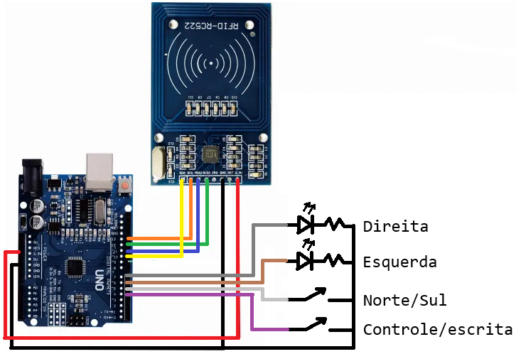

# trensurb-csde
Aplicação CSDE (Correct Side Door Enable) para TUEs da Trensurb desenvolvida para a disciplina de Projeto Integrado I da UFRGS.

# Montagem e pinagem

Requer um Arduino Uno, um módulo RFID-RC522, dois leds e (opcionalmente) duas chaves.

Conexão entre Arduino e RFID-RC522:
- Pino 13: SCK
- Pino 12: MISO
- Pino 11: MOSI
- Pino 10: SDA

Outras conexões:
- Pino 7: ânodo do LED indicador - liberação das portas direitas 
- Pino 6: ânodo LED indicador - liberação das portas esquerdas
- Pino 5: seletor do sentido de movimento
- Pino 4: seletor de modo

Ver a seção ControllerAndTagWriter.ino para mais informações sobre os seletores.



# ControllerAndTagWriter.ino

Projeto baseado em Arduino que implementa o sistema de CSDE descrito no relatório final da disciplina.

Requer:
- [Arduino IDE](https://www.arduino.cc/en/software/)
- [Biblioteca RFID_MFRC522v2](https://docs.arduino.cc/libraries/rfid_mfrc522v2/)

Se compilado com `#define TRAVEL_DIRECTION TRAVEL_DIRECTION_DYNAMIC` (padrão) determina o sentido de movimento através do pino 5. Se solto, considera o sentido Norte; se aterrado, considera o sentido Sul. Se compilado com `#define TRAVEL_DIRECTION TRAVEL_DIRECTION_NORTH` ou `#define TRAVEL_DIRECTION TRAVEL_DIRECTION_SOUTH`, considera o sentido Norte ou Sul, respectivamente.

Se compilado com `#define DEV_MODE` (padrão), inclui um escritor que pode ser usado junto com a aplicação TagWriter (descrita abaixo) para programar tags RFID de acordo com o padrão especificado no relatório. Para habilitar o escritor, o pino 4 deve ser aterrado.

# TagWriter.py

Aplicação de escrita de tags RFID. Deve ser usada junto com a aplicação ControllerAndTagWriter compilada com `#define DEV_MODE`.

Requer:
- [Python 3.12+](https://www.python.org/)
- [Módulo pyserial](https://pypi.org/project/pyserial/)

Antes de usar, conecte o Arduino ao computador usando a porta USB. Verifique que o Arduino contém o programa ControllerAndTagWriter, compilado com `#define DEV_MODE`, e que a porta 3 do Arduino está aterrada.

Para usar, alinhe a tag a ser escrita com o escritor RFID e execute o programa com os argumentos desejados. **Exemplo:** o comando abaixo grava uma tag com ID de estação 5, ID de plataforma 1, comprimento de zona de parada 12, direção de aproximação Norte e abertura das portas direitas: 

```powershell
python .\TagWriter.py --station-id 5 --platform-id 1 --stop-zone-length 12 --approach-direction N --open-right
```

Para obter uma lista dos argumentos possíveis:

```powershell
python .\TagWriter.py --help
```

As tags usadas na plataforma de testes podem ser replicadas com os seguintes comandos:

```powershell
# 1
python .\TagWriter.py --station-id 0 --platform-id 3 --stop-zone-length 0
# 2
python .\TagWriter.py --station-id 0 --platform-id 3 --stop-zone-length 4 --approach-direction S --open-left
# 3
python .\TagWriter.py --station-id 0 --platform-id 0 --stop-zone-length 4 --approach-direction N --open-right
# 4
python .\TagWriter.py --station-id 0 --platform-id 0 --stop-zone-length 0 --approach-direction N
# 5
python .\TagWriter.py --station-id 1 --platform-id 3 --stop-zone-length 0 --approach-direction S
# 6
python .\TagWriter.py --station-id 1 --platform-id 3 --stop-zone-length 1 --approach-direction S --open-right
# 7
python .\TagWriter.py --station-id 1 --platform-id 0 --stop-zone-length 1 --approach-direction N --open-left
# 8
python .\TagWriter.py --station-id 1 --platform-id 0 --stop-zone-length 0 --approach-direction N
```
